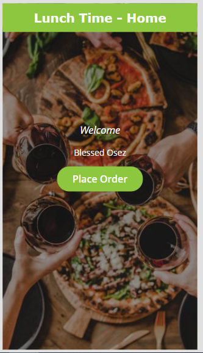

# Canteen Ordering Solution (PowerApps Project)

## Introduction
This repo contains a solution for a canteen ordering app for a bank. The bank has too many employees coming down to the canteen all at the same time. Which is causing massive queues and long delays.
The bank decided to create an application that allows employees to from their desk using their mobile fones place an order to the canteen. The canteen then cooks your order and the delivery person delivers the food to the respective employee.

## Solution Overview
To reduce the traffic at the canteen and find a more efficient way to get food  delivered to employees.
It consist of basically 2 mobile applications and 1 model driven application.

## Design Overview

